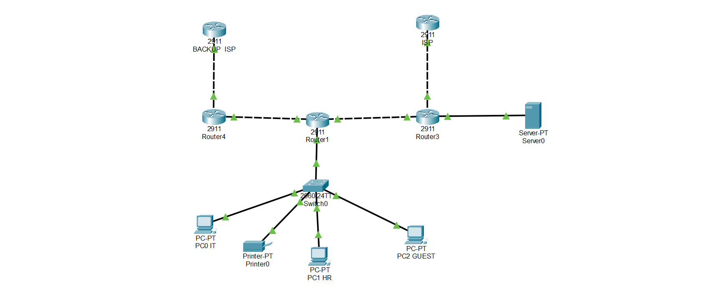

# Enterprise Branch Office Network



## Overview

This project demonstrates the design and implementation of a small-to-medium enterprise branch office network using Cisco Packet Tracer.

The project focuses on practical enterprise networking concepts through hands-on laboratory work and technical documentation.

---

## Project Features

- VLAN Segmentation
- Inter-VLAN Routing (Router-on-a-Stick)
- DHCP Configuration
- NAT (PAT)
- Access Control Lists (ACL)
- Port Security
- Spanning Tree Protocol (STP)
- Backup ISP Design

---

## Technologies Used

- Cisco Packet Tracer
- Cisco IOS
- VLAN
- DHCP
- NAT
- ACL
- STP
- Port Security

---

## Repository Structure

```text
enterprise-branch-office-network/

├── Documentation/
├── Images/
├── PacketTracer/
└── README.md
```

---

## Documentation

This repository includes personal technical documentation created during the laboratory process.

The documentation explains:

- Network design
- Configuration workflow
- Practical notes
- Troubleshooting
- Testing procedures

---

## Future Improvements

The next project will include:

- Multi-Branch Enterprise Network
- Site-to-Site VPN
- Remote Access VPN
- Cisco ASA Firewall
- Dynamic Routing
- SSH
- Syslog
- NTP
- Disaster Recovery

---

## Author

**Hüseyin Şahin**

IT Field Technician

20+ Years of IT Infrastructure Experience

Currently studying Cisco CCNA and Enterprise Networking.
